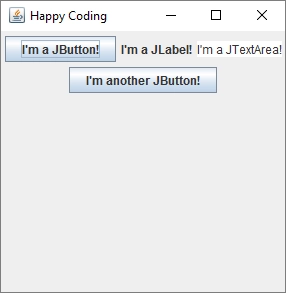
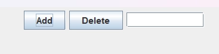
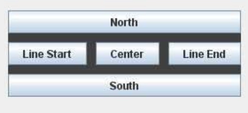
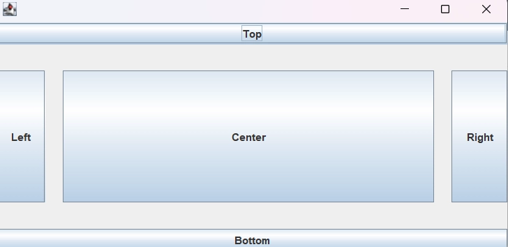
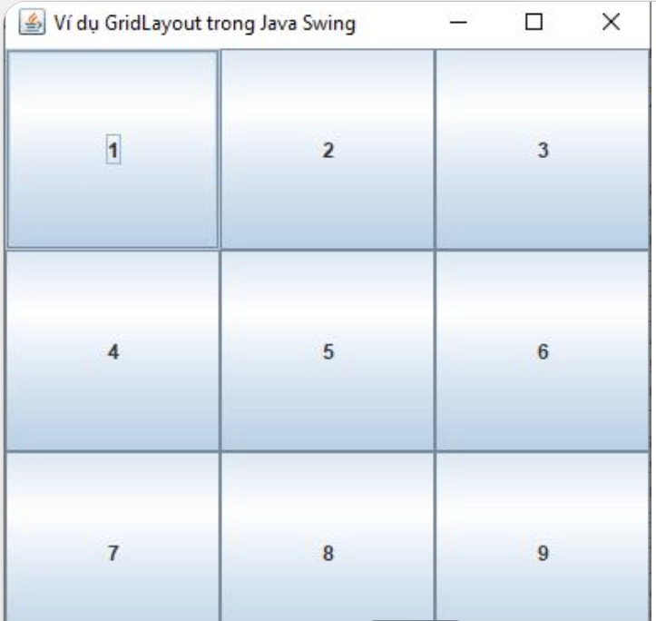
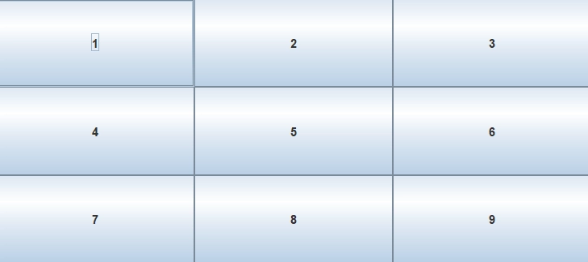

## Arrangement of elements.

### So far, we've only added one component to the window. It's not very exciting, but we can use the JPanel class to add multiple components to a window. A JPanel is a component that contains other components. To use a JPanel, follow this basic algorithm:

- Create a JPanel instance.
- Add components to the JPanel instance.
- Add the JPanel to the JFrame.

It looks like this:

```java
import javax.swing.JFrame;
import javax.swing.JPanel;
import javax.swing.JButton;
import javax.swing.JLabel;
import javax.swing.JTextArea;

public class MyGui{
    
    public static void main(String[] args){
        JFrame frame = new JFrame("Happy Coding");
        frame.setDefaultCloseOperation(JFrame.EXIT_ON_CLOSE);
        
        JPanel panel = new JPanel();
        
        JButton buttonOne = new JButton("I'm a JButton!");
        panel.add(buttonOne);
        
        JLabel label = new JLabel("I'm a JLabel!");
        panel.add(label);
        
        JTextArea textArea = new JTextArea("I'm a JTextArea!");
        panel.add(textArea);
        
        JButton buttonTwo = new JButton("I'm another JButton!");
        panel.add(buttonTwo);
        
        frame.add(panel);
        
        frame.setSize(300, 300);
        
        frame.setVisible(true);
    }
}
```

This code creates a JFrame object, then creates a JPanel instance of it. It adds four different components to the JPanel object, then adds those JPanels to the JFrame object. Finally, it sets the size of the JFrame object and displays it.



By default, components are displayed one after another, and if the window isn't wide enough to accommodate them, they wrap to multiple lines. Try changing the window width to see how the components rearrange themselves.

### Layout Managers

**🎯 Why do you need LayoutManagers at all?**

When you create a GUI, Java must decide:

- where to place a component
- what size it will be
- how the interface will change when the window is resized

This is handled by: `LayoutManager`

---

In Swing:

> The container manages the placement of components via the layout manager.

---

### 📦 Containers in Swing

---

#### 🪟 JFrame

The main application window. By default, it uses: `BorderLayout`

---

#### 📄 JPanel

A container inside a window. By default, it uses: `FlowLayout`

---

**⚠️ The most important rule:** Each container has its own layout.

---

**🧠 How Swing Layouts Components**

```
container
    ↓
layout manager
    ↓
component placement
```

---

### 📌 Basic LayoutManagers

| Layout | Where it's used |
| --- | --- |
| `FlowLayout` | simple shapes |
| `BorderLayout` | dividing the window into zones |
| `GridLayout` | tables |
| `BoxLayout` | row/column |
| `CardLayout` | switching screens |
| `GridBagLayout` | complex shapes |
| `GroupLayout` | GUI Builder |
| `SpringLayout` | exact relationships |
- **Right-to-left component orientation**

In Swing, to arrange components from right to left (for example, for Hebrew), you need to enable **RTL component orientation**.

```java 
JFrame frame = new JFrame(); 

frame.setLayout(new FlowLayout()); 

frame.applyComponentOrientation(ComponentOrientation.RIGHT_TO_LEFT); 

frame.add(new JButton("Add")); 
frame.add(new JButton("Delete")); 
frame.add(new JTextField(10)); 

frame.setSize(300, 200); 
frame.setVisible(true); 
```

👉 This is the basic method

👉 Works for the entire window and all components within it

**🧠 What it does**

- Changes the layout direction
- Components are added from right to left
- Internal text (Hebrew) is also oriented correctly

---

### 🟢 1. FlowLayout

- **FlowLayout**

**FlowLayout** is a layout manager in the **Java Swing** library that arranges components sequentially, like words in a line of text. It provides a simple and predictable way to place user interface elements without explicit coordinates, making it one of the most commonly used layout schemes in Swing.

#### **Key Facts**

- **Package:** **`java.awt`**
- **Layout Type:** flow-based
- **Default Position:** center
- **Primary Purpose:** basic arrangement of components in a row
- **Used in:** container classes, such as **`JPanel`**

#### **How It Works**

FlowLayout arranges components from left to right in the order they are added. When a row runs out of space, the manager wraps subsequent elements to a new row. The spacing between components can be adjusted using the horizontal (**`hgap`**) and vertical (**`vgap`**) gutters. When the container is resized, FlowLayout automatically redistributes elements, maintaining the flow order.

#### **Alignment Options**

FlowLayout supports several alignment types: **`LEFT`**, **`CENTER`**, **`RIGHT`**, **`LEADING`**, and **`TRAILING`**. These modes determine how components are grouped within the container when there is available space. By default, **`CENTER`** is used, which ensures a symmetrical distribution of elements.

#### **Usage in Interfaces**

This manager is often used in combination with other layouts to structure small groups of elements—for example, control buttons or input panels. It is especially useful for simple interfaces where a strict grid is not required and dynamic adaptation to the window size is convenient.

---

**📌 Visual**

```
[Button] [TextField] [Label]
```

**📌 Code**

```java
frame.setLayout(new FlowLayout());
```

---

**📌 Example**

```java
JFrame frame = new JFrame();

frame.setLayout(new FlowLayout());

frame.add(new JButton("Add"));
frame.add(new JButton("Delete"));
frame.add(new JTextField(10));
```



---

🔥 **Task#0_1**

Create a window with:

- JTextField
- two buttons:
- Add
- Delete

Arrange the elements in a row.

---

💡 **Task#0_2**

Create:

- 5 buttons
- arrange them in a single row

---

### 🔵 2. BorderLayout



- **BorderLayout**

**`BorderLayout`** is the standard layout manager in the **Java Swing** library and **`java.awt`** package. It distributes container components across five regions: **North**, **South**, **East**, **West**, and **Center**. It is one of the most commonly used layouts when creating Swing and AWT interfaces, as it provides simple and predictable placement of elements.

**Key Facts**

- **Package:** **`java.awt`**
- **Interfaces:** **`LayoutManager`**, **`LayoutManager2`**, **`Serializable`**
- **Regions:** **`NORTH`**, **`SOUTH`**, **`EAST`**, **`WEST`**, **`CENTER`**
- **Constructors:** **`BorderLayout()`**, **`BorderLayout(int hgap, int vgap)`**
- **Adding Components:** **`add(Component, String constraint)`**

`BorderLayout(int hgap, int vgap)` is a layout constructor that specifies the **margins between components** in `BorderLayout`.

**1. `hgap` (horizontal gap)**

👉 Horizontal gap (left ↔ right)

**2. `vgap` (vertical gap)**

👉 Vertical gap (top ↕ bottom)

**How it works**

Each container with **`BorderLayout`** can contain no more than one component in each of the five areas.

- The **North** and **South** areas expand horizontally.
- **East** and **West** areas expand vertically.
- **Center** takes up the remaining space and can expand in both directions.

Not specifying an area when adding a component is equivalent to **`CENTER`**.

**`BorderLayout`** also supports relative constants (**`PAGE_START`**, **`PAGE_END`**, **`LINE_START`**, **`LINE_END`**) based on text orientation (**`ComponentOrientation`**), which facilitates localization of right-to-left interfaces.

---

**📌 Visual**

```
+--------------------+
|       NORTH        |
+--------------------+
|WEST | CENTER | EAST|
|     |        |     |
+--------------------+
|       SOUTH        |
+--------------------+
```

---

**📌 Feature**

The center section takes up the remaining space.

---

**📌 Code**

```java
frame.setLayout(new BorderLayout());
```

---

**📌 Example**

```java
frame.setLayout(new BorderLayout(20,30));

frame.add(new JButton("Top"), BorderLayout.NORTH);
frame.add(new JButton("Bottom"), BorderLayout.SOUTH);
frame.add(new JButton("Left"), BorderLayout.WEST);
frame.add(new JButton("Right"), BorderLayout.EAST);
frame.add(new JButton("Center"), BorderLayout.CENTER);
```



---

**⚠️ Main Error**

```java
frame.add(button1);
frame.add(button2);
```

Both buttons go to the CENTER. The second replaces the first.

- **✅ How to set the width of a panel part**

```java
eastPanel.setPreferredSize(new Dimension(150, frame.getHeight()));
```

👉 this says:

- width ≈ 150px
- height "as it happens"

**fixed width via max/min**

```java
eastPanel.setMinimumSize(new Dimension(150, 0));
eastPanel.setPreferredSize(new Dimension(150, 0));
eastPanel.setMaximumSize(new Dimension(150, Integer.MAX_VALUE));
```

---

🔥 **Task#0_3**

Create:

- a button at the top
- a button at the bottom
- a centered text field

### 🟡 3. GridLayout



- **GridLayout**

**GridLayout** is a layout manager in the Java Swing library that arranges components in a rectangular grid of equal cells. It automatically aligns all elements into rows and columns, creating a uniform distribution of space within the application window.

**Key Facts**

- **Package:** **`java.awt`**
- **Introduced:** Java 1.0
- **Type:** Layout manager
- **Key Feature:** Uniform distribution of components across a grid
- **Associated with:** Swing, AWT

**How it works**

GridLayout divides a container into a specified number of rows and columns (**`rows`**, **`cols`**), forming a grid. Each component is placed in the next available cell, with all cells having the same size. Cell sizes are determined by the largest preferred size of the components in the grid. The gaps between cells are specified using **`hgap`** and **`vgap`**.

**Usage**

GridLayout is often used to build control panels, button tables, or other elements where even distribution is important. Code example:

```java
setLayout(new GridLayout(2, 3, 5, 5));
    add(new JButton("1"));
    add(new JButton("2"));
    add(new JButton("3"));
    add(new JButton("4"));
    add(new JButton("5"));
    add(new JButton("6"));
```

This example creates a 2x3 grid with a 5-pixel gap between elements.

**Advantages and Limitations**

**Advantages:** Ease of implementation, consistent interface appearance, automatic adaptation when the window is resized.

**Limitations:** All cells are the same size—it is not possible to specify different widths or heights for individual elements. For more flexible layouts, other managers are used, such as **GridBagLayout** or **BorderLayout**.

**Meaning**

GridLayout is a basic tool for building interfaces in Swing and AWT. It teaches the principles of Java layout managers and is often used in educational examples and small GUI applications.

**📌 Visual**

```
+-----+-----+
|  1  |  2  |
+-----+-----+
|  3  |  4  |
+-----+-----+
```

---

📌 Code

```java
frame.setLayout(new GridLayout(2,2));
```

---

**📌 Example**

```java
frame.add(new JButton("1"));
frame.add(new JButton("2"));
frame.add(new JButton("3"));
frame.add(new JButton("4"));
```

---

**🧠 Where used**

✔ Calculators

✔ Button panels

✔ Tables

---

💡 **Task#0_5**

Create a 3x3 grid of buttons.



### 🟣 4. BoxLayout

**`BoxLayout`** is a Java Swing layout manager designed for sequentially placing components in a container horizontally or vertically. It simplifies the alignment of interface elements, providing predictable behavior without automatic line breaks.

`BoxLayout` is most easily understood as:

> 👉 “Lay out components in a single line”
>
>
> either:
>
> - top to bottom
> - or left to right

---

**BoxLayout = Flexbox from CSS**

| Swing | CSS |
| --- | --- |
| `BoxLayout.Y_AXIS` | `flex-direction: column` |
| `BoxLayout.X_AXIS` | `flex-direction: row` |

---

**🔥 Main difference from FlowLayout**

**🔹 FlowLayout**

```
[A] [B] [C]
```

if space is tight:

```
[A] [B]
[C]
```

👉 wraps lines

---

**🔹 BoxLayout**

```
[A]
[B]
[C]
```

or

```
[A] [B] [C]
```

👉 NEVER wraps

---

✅ **Example**

**📌 Vertical**

```java
JPanel panel = new JPanel();

panel.setLayout(new BoxLayout(panel, BoxLayout.Y_AXIS));

panel.add(new JButton("Login"));
panel.add(new JButton("Register"));
panel.add(new JButton("Exit"));
```

---

**Result**

```
[Login]
[Register]
[Exit]
```

👉 Single Column

---

**✅ Horizontal**

```java
panel.setLayout(new BoxLayout(panel, BoxLayout.X_AXIS));
```

---

**Result**

```
[Login] [Register] [Exit]
```

---

**⚠️ Important Point**

`BoxLayout`:

- respects component sizes
- does NOT create equal cells like GridLayout

---

**🔥 Why BoxLayout is loved**

Because it's easy to create:

✔ side menus

✔ button panels

✔ forms

✔ toolbar

✔ sidebar

---

**🧩 What is Strut**

It's simply "empty space" (fixed padding).

**✔ Vertical**

```java
Box.createVerticalStrut(10)
```

👉 Fixed top/bottom padding

---

**✔ Horizontal**

```java
Box.createHorizontalStrut(10)
```

👉 Fixed left/right padding

---

**Example**

```java
panel.setLayout(new BoxLayout(panel,BoxLayout.Y_AXIS));
panel.add(new JButton("Login"));
panel.add(Box.createVerticalStrut(20));
panel.add(new JButton("Exit"));
```

---

**🧠 Result**

```
[Login]

[Exit]
```

20px between buttons

---

**🧩 What is Glue**

Glue = “stretchable white space”.

**✔ vertical**

```java
Box.createVerticalGlue()
```

👉 stretches vertically

---

**✔ horizontal**

```java
Box.createHorizontalGlue()
```

👉 stretches horizontally

---

**🔹 HorizontalGlue**

```java
panel.setLayout(new BoxLayout(panel,BoxLayout.X_AXIS));
panel.add(new JButton("Left"));
panel.add(Box.createHorizontalGlue());
panel.add(new JButton("Right"));
```

---

**🧠 Result**

```
[Left] [Right]
```

👉 glue moves components apart

**🔹 VerticalGlue**

```java
panel.setLayout(new BoxLayout(panel,BoxLayout.Y_AXIS));
panel.add(new JButton("Top"));
panel.add(Box.createVerticalGlue());
panel.add(new JButton("Bottom"));
``` 

👉 result:

``` 
[Top] 

[Bottom] 
``` 

--- 

**🔥 Sidebar menu**

```java 
JPanel menu=new JPanel(); 

menu.setLayout(new BoxLayout(menu,BoxLayout.Y_AXIS)); 

menu.add(new JButton("Home")); 
menu.add(new JButton("Profile")); 
menu.add(new JButton("Settings")); 
menu.add(new JButton("Logout")); 
```

---

**🧠 It works**

```
[Home]
[Profile]
[Settings]
[Logout]
```

👉 like a real app menu

---

**⚠️ Why BoxLayout sometimes “behaves strangely”**

Because it:

- respects preferredSize
- can stretch components

---

**🔥 Often used like this**

```
button.setAlignmentX(Component.CENTER_ALIGNMENT);
```

to align elements beautifully

**🎯 Example**

```java
JButton b1=new JButton("Home");
JButton b2=new JButton("Settings");

b1.setAlignmentX(Component.CENTER_ALIGNMENT);
b2.setAlignmentX(Component.CENTER_ALIGNMENT);
```

---

**🧠 Result**

If the container allows:

```
[Home]
[Settings]
```

👉 Everything is centered

**📌 Alignment Types**

| Value | Behavior |
| --- | --- |
| LEFT_ALIGNMENT | Align to the left |
| CENTER_ALIGNMENT | Centered |
| RIGHT_ALIGNMENT | Right |

---

**💡 When to Use**

| Layout | When |
| --- | --- |
| FlowLayout | Simple Row |
| GridLayout | Table |
| BorderLayout | Box Areas |
| BoxLayout | Column/Line Like Flexbox |

---

### 🚀 Mini Cheat Sheet

**Vertical**

```java
panel.setLayout(new BoxLayout(panel,BoxLayout.Y_AXIS));
```

**Horizontal**

```java
panel.setLayout(new BoxLayout(panel,BoxLayout.X_AXIS));
```

**Padding**

```java
Box.createVerticalStrut(10)
```

**Stretch Space**

```java
Box.createHorizontalGlue()
```

Arranges components:

- vertically
  or
- horizontally

---

**📌 Main difference from FlowLayout**

FlowLayout wraps elements.

BoxLayout creates:

- a strict column
  or
- a strict row

---

**📌 Vertical example**

```java
panel.setLayout(new BoxLayout(panel,BoxLayout.Y_AXIS));
```

```
[Button]
[Button]
```

---

**📌 Horizontal**

```java
panel.setLayout(new BoxLayout(panel,BoxLayout.X_AXIS));
```

---

### 🟠 5. CardLayout

---
**CardLayout** is a layout manager in the **Java Swing** library that allows you to toggle visible panels ("cards") within a single container (**it manages the child components of the container (JPanel))**. It is used to create tabbed interfaces, step-by-step wizards, and other scenarios where only one component is displayed at a time.

- **Example**

```java
JFrame frame = new JFrame("CardLayout");

CardLayout cardLayout = new CardLayout();

//create a JPanel and use CardLayout inside it
JPanel cards = new JPanel(cardLayout);

// First card
JPanel panel1 = new JPanel();
panel1.setBackground(Color.RED);
panel1.add(new JLabel("SCREEN 1"));

// Second card
JPanel panel2 = new JPanel();
panel2.setBackground(Color.BLUE);
panel2.add(new JLabel("SCREEN 2"));

// Add cards
cards.add(panel1, "first");
cards.add(panel2, "second");

// Toggle button
JButton nextButton = new JButton("Next");

nextButton.addActionListener(e -> {
//currently visible panel → next in the component list
cardLayout.next(cards);
});
// Show the second screen
// cardLayout.show(cards, "second");
frame.setLayout(new BorderLayout());

frame.add(cards, BorderLayout.CENTER);
frame.add(nextButton, BorderLayout.SOUTH);

frame.setSize(400,300);
frame.setDefaultCloseOperation(JFrame.EXIT_ON_CLOSE);
frame.setVisible(true);
```

**📌 Idea**

Shows only one "page" at a time.

---

**📌 Visual**

```
Screen 1
Screen 2
Screen 3
```

But only one is displayed.

---

**Where it's used**

✔ Screen switching

✔ Login forms

✔ Wizard interfaces

**`CardLayout`** is often used in step-by-step interfaces, such as installation or registration wizards, where the user navigates through several screens one by one. It is also suitable for tabbed interfaces if programmatic control of switching is required without a separate **`JTabbedPane`** element.

---

**📌 Example Idea**

`CardLayout` allows you to store multiple "screens" in a single container and only show one of them.

```
Login Screen
    ↓
Main Screen
```

- **Main Methods**

| Method | What it does |
| --- | --- |
| `show()` | show card |
| `next()` | next |
| `previous()` | previous |
| `first()` | first |
| `last()` | last |

---
